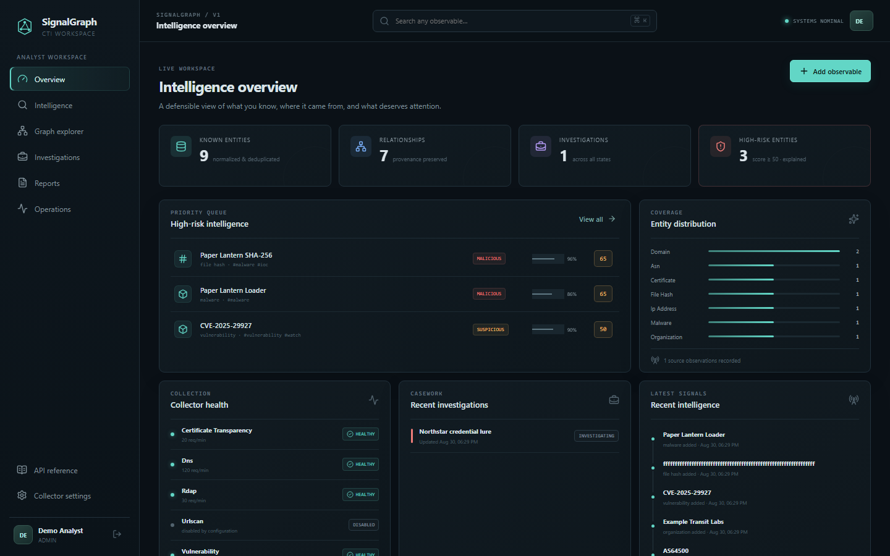
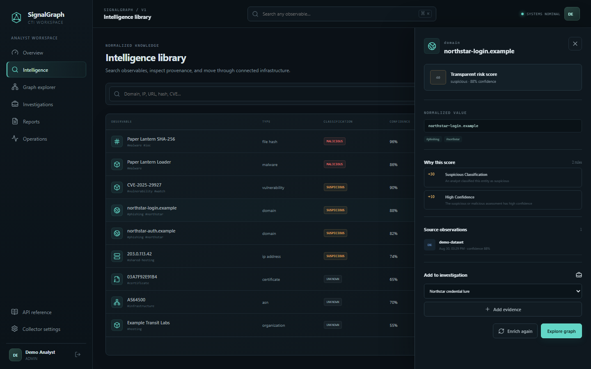
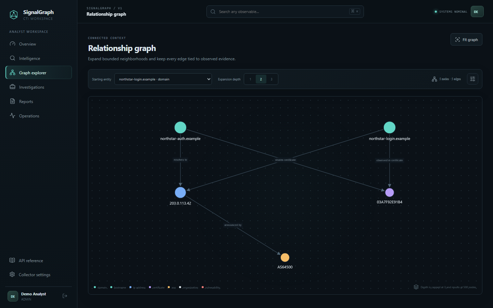
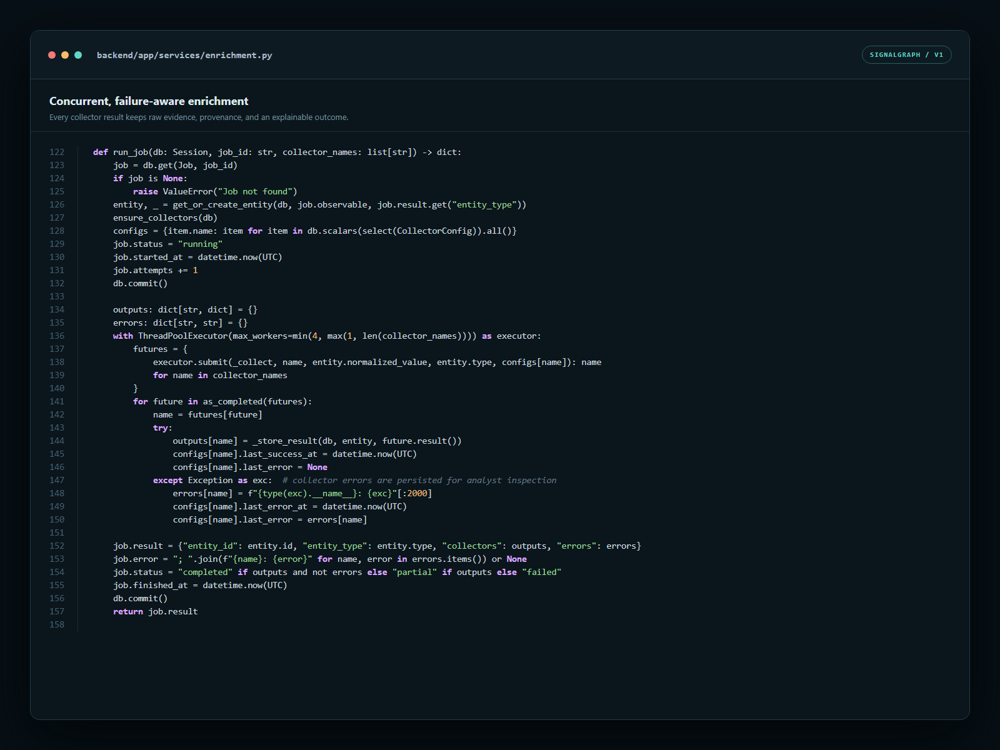

# SignalGraph

**Self-hosted, explainable cyber threat intelligence.**

[](https://github.com/Hecavex/signalgraph/actions/workflows/ci.yml)
[](CHANGELOG.md)
[](docs/INSTALLATION.md)
[](LICENSE)

SignalGraph turns scattered observables into normalized entities, source-backed relationships, transparent risk scores, investigations, and shareable reports. It is built for analysts who want useful CTI workflows without sending their intelligence to a hosted platform or requiring a commercial data subscription.

> **Version:** v1.0.0 verified release candidate · **Deployment:** Docker Compose · **License:** [Hecavex Internal Use and Security Research License 1.0](LICENSE)



_The screenshots use SignalGraph's synthetic Northstar demo dataset. No live threat data is shown._

## What SignalGraph does

SignalGraph provides one place to move from a raw observable to an evidence-backed analytical result:

1. Add a domain, hostname, IP address, URL, email, hash, certificate, ASN, CVE, or other supported entity.
2. Normalize and deduplicate the value.
3. Enrich it concurrently with passive collectors.
4. Preserve the source observation and raw response behind every derived fact.
5. Explore connected infrastructure in a bounded interactive graph.
6. Separate confidence, classification, and explainable risk.
7. Collect intelligence into investigations and chronological analyst notes.
8. Export intelligence as JSON, CSV IOCs, STIX 2.1, investigation JSON, or Markdown reports.

SignalGraph v1 includes:

- Passive DNS, RDAP, Certificate Transparency, and NVD vulnerability collectors
- Optional authenticated URLScan search integration
- Normalized entities, typed relationships, observations, tags, and provenance
- Search, filtering, server-side pagination, and detailed entity inspection
- Configurable risk rules with a visible point-by-point explanation
- Interactive graph expansion with depth and result safety limits
- Investigation entities, evidence relationships, notes, and timelines
- Analyst reports with executive summary, assessment, confidence, and linked intelligence
- Local authentication with viewer, analyst, and administrator roles
- Collector health, background jobs, retries, scheduler, audit log, and demo data
- PostgreSQL, Redis, Celery, Alembic migrations, health checks, and structured logs

## Why it is useful

Threat data is often split across terminal output, browser tabs, spreadsheets, and vendor portals. That makes it difficult to answer basic analytical questions: What is the original source? Which facts were inferred? Why is this object considered risky? What changed hands during an investigation?

SignalGraph keeps those answers attached to the intelligence. Risk is not a mystery number, collector failures remain visible, relationships carry source context, and exports retain stable identifiers. The result is easier to review, hand off, reproduce, and defend.

### Evidence and explainability



An entity drawer shows its normalized value, classification, confidence, contributing risk rules, tags, and source observations. Risk and confidence remain deliberately separate.

### Connected infrastructure



The graph supports bounded one-to-three-hop exploration and caps results at 500 nodes. Analysts can pivot without accidentally requesting an unbounded traversal.

### Failure-aware collection



Collectors run concurrently, record success and failure independently, retain raw evidence, and return completed, partial, or failed job states instead of hiding incomplete enrichment.

## Architecture

| Layer | v1 implementation |
| --- | --- |
| Web application | React 19, TypeScript, Vite, Cytoscape, Nginx |
| API | FastAPI, Pydantic validation, SQLAlchemy |
| Persistence | PostgreSQL 16 with Alembic migrations |
| Background work | Redis, Celery worker, Celery Beat scheduler |
| Authentication | Local accounts, Argon2 passwords, signed bearer tokens, RBAC |
| Deployment | Docker Compose on user-controlled infrastructure |

The browser talks only to the SignalGraph API. Enrichment jobs pass through Redis to workers, which contact fixed, allowlisted passive services; submitted URLs are not fetched directly. PostgreSQL remains the system of record for intelligence, provenance, cases, reports, job state, and audit events.

## Quick start

### Requirements

- Docker Engine 24+ or Docker Desktop
- Docker Compose v2
- At least 4 GB RAM and 10 GB free storage

### Run SignalGraph

```bash
cp .env.example .env
python -c "import secrets; print(secrets.token_urlsafe(48))"
```

Replace the `SECRET_KEY` and database-password placeholders in `.env`, keeping the password in `DATABASE_URL` synchronized with `POSTGRES_PASSWORD`. Then start the stack:

```bash
docker compose up --build -d
docker compose ps
```

Open [http://localhost:8080](http://localhost:8080). On a clean database, the first-run screen creates the local administrator. The API reference is available at [http://localhost:8000/api/docs](http://localhost:8000/api/docs).

Verify the deployment:

```bash
docker compose exec api signalgraph doctor
```

To load the clearly labeled synthetic dataset used in the screenshots:

```bash
docker compose exec api signalgraph seed-demo
```

Do not expose a demo deployment or retain its default demo password. See the full [installation guide](docs/INSTALLATION.md) for health checks, reverse-proxy guidance, and clean shutdown instructions.

## Everyday workflow

- Add or enrich an observable from **Intelligence**.
- Inspect its normalized identity, evidence, and risk explanation.
- Open **Graph explorer** to pivot through related infrastructure.
- Create an **Investigation**, attach intelligence, and record analytical notes.
- Build a **Report** with judgments and confidence.
- Export only the format appropriate for the receiving system.
- Monitor collector and job health under **Operations**.

More detail is available in the [user guide](docs/USER_GUIDE.md) and [API guide](docs/API.md).

## Development and tests

The backend requires Python 3.12. The frontend uses Node.js 22 in its production build. SQLite is supported for isolated development and tests; PostgreSQL is the supported deployment database.

```powershell
python -m venv .venv
.\.venv\Scripts\python.exe -m pip install -e ".\backend[dev]"
cd frontend
npm ci --legacy-peer-deps
```

Run the verification suites:

```powershell
.\.venv\Scripts\python.exe -m pytest backend\tests
.\.venv\Scripts\ruff.exe check backend
cd frontend
npm test
npm run build
npm run test:e2e
```

See [development setup](docs/DEVELOPMENT.md), [compatibility policy](docs/COMPATIBILITY.md), and [contribution guidance](CONTRIBUTING.md).

## Security model

SignalGraph is a defensive, passive-first research tool. It does not exploit targets, test credentials, deliver payloads, or perform unauthorized active scanning. Collectors use fixed service origins, disable redirects, enforce timeouts and rate limits, and cap stored raw responses. Deployment secrets belong in `.env`, which is excluded from version control.

Review the [security model](docs/SECURITY_MODEL.md) and [security policy](SECURITY.md) before exposing a deployment. Keep PostgreSQL and Redis private, place the web application behind TLS, and test [backup and restore](docs/BACKUP_RESTORE.md) before relying on the system.

## Future improvements

The version-gated roadmap intentionally keeps future work out of v1:

- **v2 — Operational CTI and automation:** watchlists, explainable findings, historical changes, correlation, notifications, detection-rule workflows, and optional MISP/OpenCTI/TAXII integrations.
- **v3 — Advanced research and analytics:** deeper research workflows, richer analytical assistance, and optional AI-supported analysis with evidence controls.
- **v4 — Distributed collection and team operations:** distributed collectors, larger deployments, and expanded collaborative workflows.
- **v5 — Platform and community ecosystem:** stable extension interfaces, plugins, and community-maintained capabilities.

Future features are not treated as present until their version is explicitly activated, implemented, tested, and verified.

## Project status and license

v1 has passed its release-candidate audit, including clean Docker installation, backup/restore, security, migration, automated, and browser workflow checks. It should not be represented as a stable release until hosted CI passes and the maintainer tags v1.0.0.

SignalGraph is source-available under the [Hecavex Internal Use and Security Research License 1.0](LICENSE), copyright Deividas Lis. Companies may run and privately modify it for their own internal operations, and lawful good-faith security research is permitted. Resale, redistribution, hosted or managed services, client deliverables, and public modified versions are not permitted. Publications that substantially feature SignalGraph must identify it as a Hecavex project, credit Deividas Lis, and include the required project and Hecavex links described in the license.

This is a custom license, not an OSI-approved open-source license. For uses outside its terms or a separate written license, contact the maintainer through [LinkedIn](https://www.linkedin.com/in/deilis) or visit [hecavex.com](https://hecavex.com).

## Community and support

- Use [GitHub Discussions](https://github.com/Hecavex/signalgraph/discussions) for questions, ideas, and deployment conversations.
- Use [GitHub Issues](https://github.com/Hecavex/signalgraph/issues) for reproducible defects and focused feature proposals.
- Report vulnerabilities privately through [GitHub Security Advisories](https://github.com/Hecavex/signalgraph/security/advisories/new).
- Read the [contribution policy](CONTRIBUTING.md), [support guide](SUPPORT.md), and [code of conduct](CODE_OF_CONDUCT.md) before participating.

If SignalGraph is useful to you, starring the repository helps other defenders and security researchers discover it.
